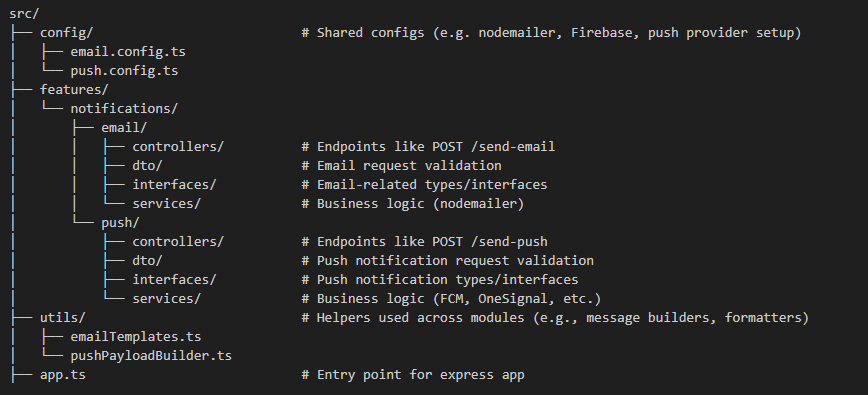

## Project Overview

This microservice handles all notification-related functionality, including sending emails such as password recovery messages.

## Prerequisites

### Install Node.js
1. Download the MSI installer from [Node.js Downloads](https://nodejs.org/en/download/).

2. Verify the installation by running the following command in the terminal:
   ```
   node -v
   ```
3. Open PowerShell as an administrator and execute:
   ```
   Set-ExecutionPolicy -Scope CurrentUser -ExecutionPolicy RemoteSigned
   ```
4. Verify npm installation:
   ```
   npm -v
   ```

### Install TypeScript and Dependencies
Run the following commands:
```
npm install -g typescript ts-node nodemon
npm install express body-parser cookie-parser compression cors
npm install -g @types/express @types/body-parser @types/cookie-parser @types/compression @types/cors
npm install --save-dev @types/supertest jest ts-jest @types/jest
npm install --save-dev @types/express


```

### Install nodemailer

npm install express nodemailer dotenv
npm i --save-dev @types/nodemailer

##  Project Structure



##  Description of Key Components

- **`config/`**: Contains configuration files such as the email transporter setup using `nodemailer`.

- **`features/notifications/controllers/`**: Defines route handlers that receive HTTP requests and call the necessary services.

- **`features/notifications/dto/`**: Contains classes or schemas used to validate and transform the request payloads.

- **`features/notifications/interfaces/`**: Defines TypeScript types or interfaces for clean typing across the codebase.

- **`features/notifications/services/`**: Contains the main business logic for sending different types of notifications.

- **`utils/`**: Stores utility functions like template generators or logging tools.

- **`app.ts`**: Main entry file that sets up the Express server and loads routes.